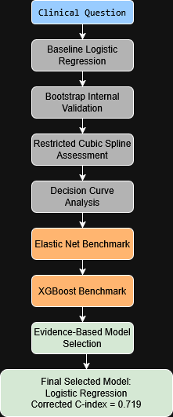
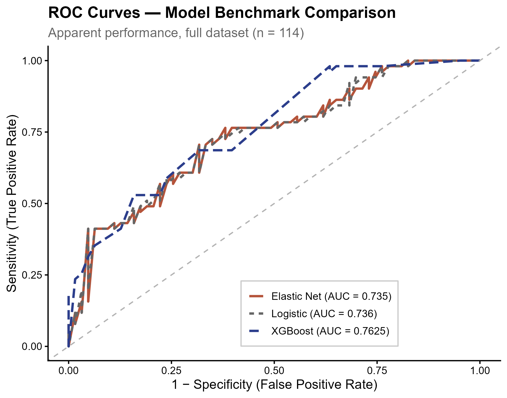
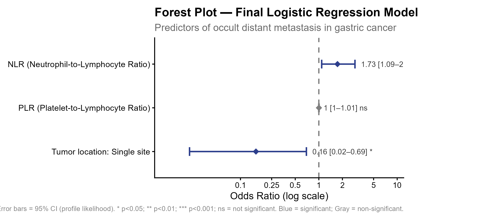

# Occult Distant Metastasis Prediction in Gastric Cancer

## A Bootstrap-Validated Comparison of Logistic Regression, Elastic Net, and XGBoost

---

## Project Overview

Occult distant metastasis remains a major challenge in the staging of gastric cancer. In many healthcare systems, particularly resource-constrained settings, advanced imaging modalities such as contrast-enhanced CT, MRI, PET/CT, or staging laparoscopy cannot always be performed immediately for every patient.

Early identification of patients at high risk of distant metastasis may help clinicians prioritize diagnostic resources, optimize treatment planning, and avoid unnecessary procedures.

This project investigates whether modern machine-learning algorithms can meaningfully improve the performance of an already deployable clinical prediction model for occult distant metastasis in gastric cancer.

---

## Background

A multivariable logistic regression model was previously developed using routinely available pre-treatment variables:

* Tumor location pattern (Single-site vs Overlapping lesions)
* Neutrophil-to-Lymphocyte Ratio (NLR)
* Platelet-to-Lymphocyte Ratio (PLR)

The model was translated into:

* A clinical nomogram
* A web-based risk calculator

making it suitable for real-world clinical deployment.

However, an important methodological question remained:

> Can modern machine-learning algorithms provide sufficient predictive gains to justify replacing an already interpretable and deployable logistic regression model?

---

## Research Question

**Can machine learning outperform a rigorously validated logistic regression model for predicting occult distant metastasis in gastric cancer?**

### Initial Hypothesis

Elastic Net regularization and XGBoost may capture nonlinear patterns or complex predictor relationships and therefore achieve superior predictive performance compared with conventional logistic regression.

---

## Methodological Workflow

This project implemented a structured prediction-modeling workflow based on modern clinical prediction modeling principles.



### Analysis Pipeline

1. Baseline Logistic Regression
2. Bootstrap Internal Validation
3. Restricted Cubic Spline Assessment
4. Decision Curve Analysis
5. Elastic Net Benchmark
6. XGBoost Benchmark
7. Evidence-Based Model Selection

---

## Dataset

### Study Design

* Retrospective single-center cohort study

### Sample Size

* Total patients: 114
* Distant metastasis present: 51
* Distant metastasis absent: 63

### Outcome

* Presence of distant metastasis at diagnosis

### Predictors

* Tumor_mlocation3
* NLR
* PLR

### Data Availability

The original dataset contains patient-level clinical information and cannot be publicly released due to institutional and privacy restrictions.

All analysis scripts, validation procedures, model development workflows, and publication-quality outputs are provided to ensure methodological transparency and reproducibility.

---

## Main Results

### Model Performance Comparison

| Model               | Corrected C-index | Optimism |
| ------------------- | ----------------: | -------: |
| Logistic Regression |             0.719 |    0.017 |
| Elastic Net         |             0.718 |    0.017 |
| XGBoost             |             0.684 |    0.079 |

### Final Selected Model

**Logistic Regression**

### Why Logistic Regression Won

* Comparable discrimination
* Lower optimism
* Acceptable calibration
* Full clinical interpretability
* Direct nomogram compatibility
* Straightforward deployment as a web calculator

---

## Key Findings

Contrary to the initial hypothesis, machine-learning methods did not provide meaningful performance improvements.

### Restricted Cubic Splines

* No meaningful nonlinear effects identified.

### Elastic Net

* Produced virtually identical optimism-corrected performance compared with logistic regression.

### XGBoost

* Higher apparent discrimination.
* Substantially higher optimism after bootstrap correction.
* No meaningful clinical advantage.

### Final Conclusion

A carefully developed and rigorously validated logistic regression model remained the preferred solution.

This project demonstrates that for small-to-moderate clinical datasets, methodological rigor and transparent validation may be more valuable than algorithmic complexity.

---

## Figure Gallery

### Model Benchmark Comparison



### Final Logistic Regression Model



---

## Repository Structure

```text
GC_Metastasis_Prediction/

README.md
LICENSE

scripts/
figures/
tables/
docs/
```

### Scripts

```text
01_logistic_regression.R

02_bootstrap_validation.R

03_rcs_analysis.R

04_decision_curve_analysis.R

05_elastic_net_benchmark.R

06_xgboost_benchmark.R

07_final_model_selection.R
```

---

## Reproducibility Guide

Run scripts sequentially:

```r
01_logistic_regression.R

02_bootstrap_validation.R

03_rcs_analysis.R

04_decision_curve_analysis.R

05_elastic_net_benchmark.R

06_xgboost_benchmark.R

07_final_model_selection.R
```

All analyses were conducted in R.

---

## Important Limitations

### Development Dataset

This was a single-center retrospective cohort study.

External validation was not available and remains necessary before clinical implementation.

### Decision Curve Analysis

Decision Curve Analysis was performed on the development dataset and therefore may overestimate clinical utility.

### Dataset Prevalence

The prevalence of distant metastasis in this cohort was relatively high (44.7%), which may limit direct transportability to populations with different disease prevalence.

---

## Skills Demonstrated

### Clinical Prediction Modeling

* Logistic Regression
* Odds Ratio Interpretation
* Clinical Risk Prediction

### Validation

* Bootstrap Internal Validation
* Optimism Correction
* Calibration Assessment

### Advanced Statistical Modeling

* Restricted Cubic Splines
* Decision Curve Analysis

### Machine Learning

* Elastic Net
* XGBoost
* Hyperparameter Tuning
* Model Benchmarking

### Reproducible Research

* Structured analytical workflow
* Transparent model selection
* Publication-oriented reporting

---

## Project Outcome

This project evolved from a previously developed clinical nomogram and web calculator into a systematic investigation of whether machine-learning approaches could improve prediction performance.

The final evidence demonstrated that increased model complexity did not translate into meaningful clinical benefit.

The logistic regression model therefore remained the preferred and final locked model.

---

## Citation

If you find this project useful for academic or educational purposes, please cite the repository appropriately.
